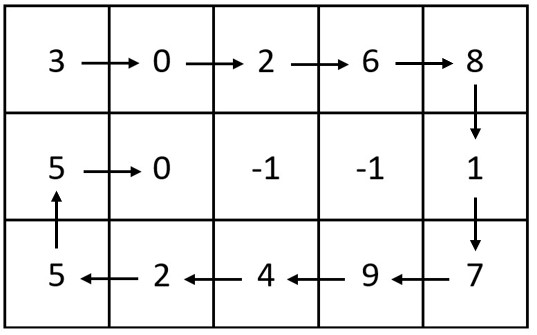

### [59. 螺旋矩阵 II](https://leetcode.cn/problems/spiral-matrix-ii/)

给你一个正整数 `n` ，生成一个包含 1 到 $n^2$ 所有元素，且元素按顺时针顺序螺旋排列的 `n x n` 正方形矩阵 `matrix` 。
 

**示例 1：**

>输入：n = 3
输出：[ [1,2,3], [8,9,4], [7,6,5] ]

**示例 2：**
>输入：n = 1
输出：[ [1] ]

```java
class GenerateMatrix {
    public int[][] generateMatrix(int n) {
        int[][] res = new int[n][n];
        int left = 0, right = n - 1;
        int up = 0, down = n - 1;
        int index = 1;
        while (true){
            for (int i = left; i <= right; i++) {
                res[up][i] = index++;
            }
            if (++up > down){
                break;
            }
            for (int i = up; i <= down; i++) {
                res[i][right] = index++;
            }
            if (--right < left){
                break;
            }
            for (int i = right; i >= left; i--) {
                res[down][i] = index++;
            }
            if (--down < up){
                break;
            }
            for (int i = down; i >= up; i--) {
                res[i][left] = index++;
            }
            if (++left > right){
                break;
            }
        }
        return res;
    }
}
```


### [6111. 螺旋矩阵 IV](https://leetcode.cn/problems/spiral-matrix-iv/solution/)

给你两个整数：`m` 和 `n` ，表示矩阵的维数。

另给你一个整数链表的头节点 `head` 。

请你生成一个大小为 `m x n` 的螺旋矩阵，矩阵包含链表中的所有整数。链表中的整数从矩阵 **左上角** 开始、**顺时针** 按 **螺旋** 顺序填充。如果还存在剩余的空格，则用 `-1` 填充。

返回生成的矩阵。

**示例 1：**

>输入：m = 3, n = 5, head = [3,0,2,6,8,1,7,9,4,2,5,5,0]
输出：[ [3,0,2,6,8], [5,0,-1,-1,1], [5,2,4,9,7] ]
解释：上图展示了链表中的整数在矩阵中是如何排布的。
注意，矩阵中剩下的空格用 -1 填充。

**示例 2：**

>输入：m = 1, n = 4, head = [0,1,2]
输出：[ [0, 1, 2, -1] ]
解释：上图展示了链表中的整数在矩阵中是如何从左到右排布的。 
注意，矩阵中剩下的空格用 -1 填充。

```py
class SpiralMatrix:
    def spiralMatrix(self, m: int, n: int, head: Optional[ListNode]) -> List[List[int]]:
        DIRS = [(0,1), (1,0), (0,-1), (-1,0)]
        res = [[-1] * n for _ in range(m)]
        i = j = di = 0
        while head:
            res[i][j] =  head.val
            head = head.next

            dx, dy = DIRS[di]
            if i+dx < 0 or i+dx >= m or j+dy < 0 or j+dy >= n or res[i+dx][j+dy] != -1:
                di = (di + 1) % 4
            dx, dy = DIRS[di]
            i += dx
            j += dy

        return res
```